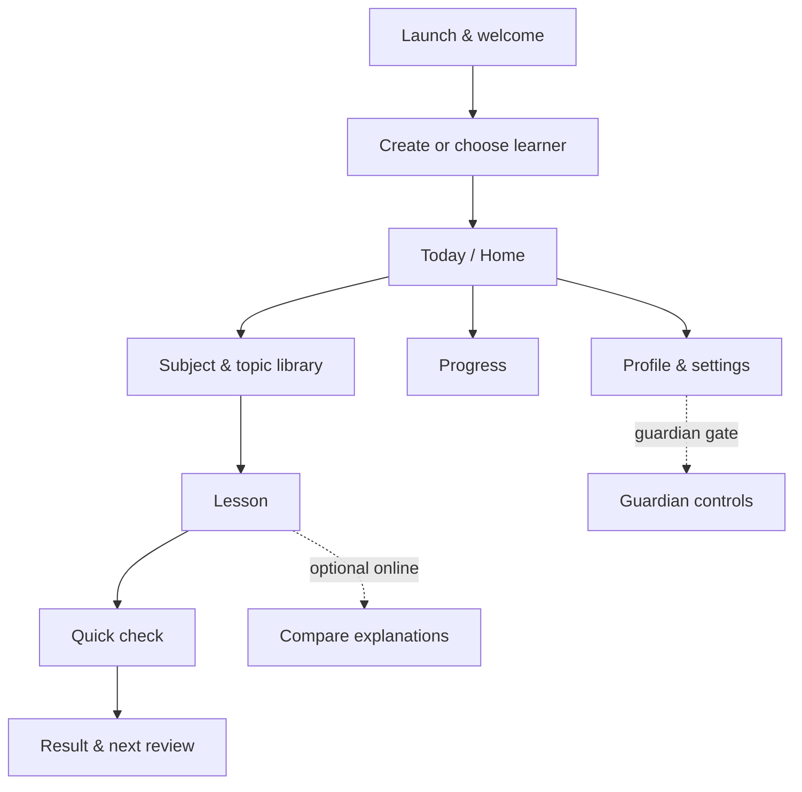

# EduCloud Android UI/UX Screen Plan

## Purpose and scope

This is the complete proposed Android screen inventory for EduCloud. It separates the **current MVP** from the screens needed for a responsibly completed learner product across the full primary-school curriculum. It is a UI/UX plan, not evidence that an unbuilt or safety-gated feature already exists.

**Product principle:** the learner must be able to complete the core loop offline: open a lesson, understand a short explanation, answer a check question, and see what to do next. This must work consistently for every approved subject. Cloud, messaging, and account-linked features must never block that loop.

### Completed-product curriculum model

The finished app is not “a Maths app with other subjects added as tiles.” It has one reusable learning engine—lesson, practice, source proof, review, progress—and approved subject packs plug into it. The initial catalogue should cover **Mathematics, English, Kiswahili, Science & Technology, Social Studies, Creative Arts, Religious Education (CRE/IRE/HRE as locally selected), Agriculture, Health/PE, and Digital Literacy**. Final grade/subject names and content mappings must be teacher-reviewed and aligned with the applicable Kenyan curriculum before publication.

Each subject receives a recognisable but accessible accent colour and a small original EduCloud guide character/visual motif; the layout, controls, source labelling, and feedback language remain consistent throughout the app.

### Scope labels

| Label | Meaning |
|---|---|
| MVP now | In the Grade 3 Maths demo scope; design and build now. |
| Next | Valuable Android feature after the demo; requires normal product work. |
| Gated | Do not ship until consent, privacy, content review, security, and/or provider conditions are met. |
| Not an Android page | A USSD/SMS/IVR interaction or backend/admin surface, documented to avoid designing a misleading Android screen. |

## Navigation model

Use a persistent bottom navigation only after onboarding: **Today**, **Learn**, **Progress**, **Profile**. Keep the lesson itself distraction-free with a back button, lesson progress, and one primary action. A low-end phone should not need a drawer, gesture-only controls, or a multi-column layout.

## Screen inventory

### Session 1 — launch, trust, and learner setup

| ID | Page | What it does | Scope |
|---|---|---|---|
| A01 | Splash / local-content loading | Shows EduCloud branding while checking the installed content pack and local database; includes a recoverable error if the pack is unavailable. | MVP now |
| A02 | Welcome | States the learning promise, that core lessons work offline, and a clear “Start” action. No sign-in is required for the demo. | MVP now |
| A03 | Learner name | Collects a display name/alias only; explains that it is stored on the device. | MVP now |
| A04 | Grade selection | Selects grade; MVP supports Grade 3 and should clearly label other grades as unavailable instead of pretending they work. | MVP now |
| A05 | Shared-device learner picker | Lets a family choose, add, rename, or remove a local learner profile without relying on a phone number. | Next |
| A06 | Age/guardian consent | Explains data choices and asks the guardian for consent before any account, cloud service, analytics, or messaging link is activated. | Gated |
| A07 | Permissions explainer | Explains why a permission is needed before triggering Android’s system prompt; no phone/SMS permission is needed for the offline tutor. | Next |
| A08 | Offline pack/update choice | Lets a guardian download, update, or defer an approved content pack over Wi-Fi; displays size and version. | Gated |

### Session 2 — daily learner home

| ID | Page | What it does | Scope |
|---|---|---|---|
| B01 | Today / Home | Main landing page: greeting, offline status, one recommended next action, continue-lesson card, and short streak/progress summary. | MVP now |
| B02 | Daily plan | Shows a small, calm list of today’s recommended reviews and new lesson; allows “do this later.” | Next |
| B03 | Notifications inbox | Shows in-app reminders, pack-update notices, and guardian-approved messages; each item is readable offline. | Next |
| B04 | Search | Searches installed lesson titles/topics with filters for subject, grade, and completed status. | Next |

### Session 3 — finding content

| ID | Page | What it does | Scope |
|---|---|---|---|
| C01 | Subject library | Lists approved subjects as vivid, accessible cards with progress and download status. MVP shows Mathematics only, not empty or fake subject cards. | MVP now |
| C02 | Grade curriculum map | Shows the learner’s subject strands for the selected grade, including the next recommended strand. | Next |
| C03 | Topic library | Shows topic lessons, practice, estimated time, and downloaded/offline status. | Next |
| C04 | Topic detail | Explains a topic, lists its lessons and practice, and highlights the recommended starting point. | Next |
| C05 | Lesson preview | Shows objectives, estimated time, required materials, provenance, and “Start lesson.” | Next |
| C06 | Saved / downloaded lessons | Lists lessons intentionally saved for offline use and shows storage use. | Next |

### Session 4 — the core teaching loop

| ID | Page | What it does | Scope |
|---|---|---|---|
| D01 | Lesson player | Presents one short concept at a time using the right activity pattern for the subject: worked example for Maths, reading/listening for languages, observation for Science, map/timeline for Social Studies, or make-and-share prompt for Creative Arts. It always retains plain-language explanation and a progress stepper. | MVP now |
| D02 | Guided practice | Lets the learner answer one small step at a time with hints and a “show me” option. | Next |
| D03 | Tutor question | Lets the learner ask about the current lesson; retrieves only from the installed source pack and displays a grounded answer. | MVP now (currently called chat) |
| D04 | Source / “Why this answer?” sheet | Shows lesson title, grade, topic, source pack, content version, and the retrieved passage behind a tutor answer. | MVP now |
| D05 | Low-memory mode sheet | Explains that the app is using retrieval-only teaching, not a local model; the learner can continue normally. | MVP now |
| D06 | Cloud comparison | Places the **offline lesson answer** and an explicitly optional **cloud-enhanced explanation** side by side, with source and failure fallback. | Gated |
| D07 | Check-for-understanding | One age-appropriate multiple-choice or tap-to-order question after a lesson step; gives immediate, kind feedback. | MVP now |
| D08 | Hint / worked-answer sheet | Shows a progressively revealed hint, then a full explanation; records neither as a penalty nor as “cheating.” | Next |
| D09 | Lesson complete | Celebrates completion without overloading the learner; says what was learned and offers the next best action. | Next |

### Session 5 — assessment, feedback, and revision

| ID | Page | What it does | Scope |
|---|---|---|---|
| E01 | Quick quiz intro | States the number of questions and that it is practice, not a high-stakes exam. | MVP now |
| E02 | Quiz question | Shows one question at a time with large, tappable answers and progress. Supported activity types expand to matching, ordering, short text, image choice, and audio response only after each has accessibility and offline support. | MVP now |
| E03 | Answer feedback | Confirms correct answers or calmly explains the correction before moving on. | MVP now |
| E04 | Quiz result | Shows score, strengths, one revision suggestion, and “Try again” / “Continue learning.” | MVP now |
| E05 | Review queue | Shows the learner’s due 1/3/7/14/30-day reviews, with a short “why this is due” explanation. | Next |
| E06 | Revision session | Runs a compact, mixed review flow and updates only locally unless a guardian-approved sync is available. | Next |

### Session 6 — progress and motivation

| ID | Page | What it does | Scope |
|---|---|---|---|
| F01 | Progress overview | Gives a child-friendly view of completed lessons, current topic, reviews due, and learning time; avoids claiming calibrated ability. | Next |
| F02 | Subject progress | Breaks progress down by topic: started, practising, and confident. | Next |
| F03 | Learning history | Lists past lessons/quizzes and allows the learner to reopen them locally. | Next |
| F04 | Streak / achievements | Uses gentle recognition for consistent effort; no public leaderboard or shame-based broken-streak treatment. | Next |

### Session 7 — profile, device, and safety controls

| ID | Page | What it does | Scope |
|---|---|---|---|
| G01 | Learner profile | Lets the learner view their alias, grade, avatar, and local learning summary. | Next |
| G02 | App settings | Controls text size, colour/contrast, sound, animation reduction, language availability, and offline preferences. | Next |
| G03 | Content & storage | Shows installed packs, provenance/review status, version, storage used, and safe update/delete choices. | Next |
| G04 | Help & support | Provides simple offline help, safe troubleshooting, and contact/support information. | Next |
| G05 | About, privacy & licences | Shows app version, privacy summary, content provenance, open-source licences, and known limits. | Next |
| G06 | Guardian gate | PIN/verified guardian check before entering controls that expose data, connectivity, or messaging settings. | Gated |
| G07 | Guardian controls | Manages profiles, consent, cloud-mode choice, usage summary, data export/deletion requests, and notification preferences. | Gated |
| G08 | Account / sync recovery | Connects or recovers a guardian-approved account and resolves sync conflicts in understandable language. | Gated |

### Session 8 — companion channels and role-based tools

| ID | Page | What it does | Scope |
|---|---|---|---|
| H01 | Feature-phone simulator | A **demo-only** Android page showing the simulated USSD and SMS flows. It must prominently say it sends nothing and reads no phone data. | MVP now |
| H02 | Channel setup/status | Shows whether a guardian-approved, sandbox-tested messaging channel is connected; never collects a child phone number in the learner journey. | Gated |
| H03 | Teacher mode entry | Role-selection/authorisation entry point for teachers using the same Android application. | Gated |
| H04 | Teacher class overview | Shows only authorised class-level progress and review needs; it requires an authenticated school/teacher service. | Gated |
| H05 | Teacher learner support | Lets an authorised teacher view a selected learner’s learning evidence and assign approved content; includes auditable access. | Gated |
| H06 | Teacher lesson helper | Generates or adapts a lesson-plan draft from approved content; it must be teacher-reviewed before use. | Gated |

### Session 9 — required system states (not optional “extra pages”)

Every substantive screen needs these designed states, usually as a full screen or reusable template:

| ID | Page/state | What it does | Scope |
|---|---|---|---|
| S01 | First-load / skeleton | Confirms that content is loading without a blank or frozen-looking screen. | MVP now |
| S02 | Empty state | Explains why a list is empty and gives a single next action. | MVP now |
| S03 | Offline / connection state | Reassures learners the offline core remains available and labels online-only actions. | MVP now |
| S04 | Error & retry | Uses plain language, preserves work where possible, and offers retry/back/help. | MVP now |
| S05 | Content unavailable | Explains that a pack or lesson is not installed, with guardian-safe update options. | Next |
| S06 | Cloud unavailable fallback | Clearly says the optional cloud explanation could not load and continues with the local answer. | Gated |
| S07 | Consent required | Stops protected actions with a clear guardian route; never pressures the child to seek consent. | Gated |
| S08 | Update required | Explains the reason, download size, Wi-Fi recommendation, and whether the core app remains usable. | Next |
| S09 | Maintenance / service notice | Communicates temporary service issues without obscuring the offline learning path. | Gated |
| S10 | Accessibility settings preview | Lets users verify text scale, contrast, and reduced motion before applying them app-wide. | Next |

## What exists today versus the designed target

| Existing Compose route | Target screen ID(s) | Design decision |
|---|---|---|
| Onboarding | A02–A04 | Split the current two-step form into a more welcoming, privacy-aware flow. |
| Home | B01, C01 | Keep it focused on one recommended action; Mathematics is the only visible subject in the MVP, then enable approved subject packs. |
| Subject hub | C01–C04 | Evolve from an action menu into a subject, grade-strand, and topic library. |
| Tutor chat | D01, D03–D05 | Replace a general-chat feeling with a lesson-first teaching flow and expandable proof/source panel. |
| Quiz + result | E01–E04 | Retain the one-question-at-a-time pattern; add warm feedback and a next-step recommendation. |
| Feature-phone demo | H01 | Keep only as a transparent simulator until live-channel safety gates are complete. |

## Design system direction

- **Tone:** warm, capable, and calm—not cartoonish. Use achievement as encouragement, never pressure.
- **Layout:** single-column, 8 dp spacing scale, 48 dp minimum touch targets, and primary actions anchored near the thumb zone.
- **Typography:** large, highly legible text; body copy should fit Grade 3 reading level. Respect Android font scaling without clipped buttons.
- **Colour:** give each subject a memorable accent (Maths blue, English coral, Kiswahili green, Science teal, Social Studies amber, Arts purple) while preserving one shared neutral surface system. Use colour plus text/icon to communicate status; never use red alone for mistakes.
- **Offline truthfulness:** show “Available offline” only when the exact lesson is installed. Label cloud content, source, version, and fallback explicitly.
- **Privacy by design:** no child phone-number entry, public rankings, dark patterns, or forced sign-in. Guardian-only controls are visibly separate.
- **Performance:** use local illustrations and compressed assets; avoid autoplay video, endless animation, and content that depends on a network call.

## Recommended design-production order

1. **Foundation:** tokens (colour, type, spacing, icons), buttons, cards, input, feedback, empty/error/offline states.
2. **Core MVP prototype:** A02–A04, B01, C01, D01/D03–D05, D07, E01–E04, H01, S01–S04. Build the components subject-agnostically even though the first pack is Mathematics.
3. **Validate the learner journey:** test the core prototype on a small Android phone with children/teachers only after appropriate consent; observe comprehension, tap accuracy, and offline understanding.
4. **Learning depth:** C02–C05, D02/D08/D09, E05/E06, F01–F04.
5. **Guardian/device trust:** G01–G05 and A05/A07. Build G06–G08 only after the consent, privacy, and security design is approved.
6. **Online and institutional tools:** D06, H02–H06, and S05–S10 only after their documented gates are completed.

## Completion definition for the Android learner app

The learner Android app is functionally complete when a learner can use a shared/offline device to choose a local profile, choose any teacher-approved installed subject, find a grade-appropriate lesson, learn and practise, understand the source of a tutor response, complete a review, see local progress, and use accessibility/settings controls—without requiring cloud access. Cloud comparison, guardian linking, messaging, and teacher tools become complete only when their separate safety, consent, content, provider, and security gates have been verified.
