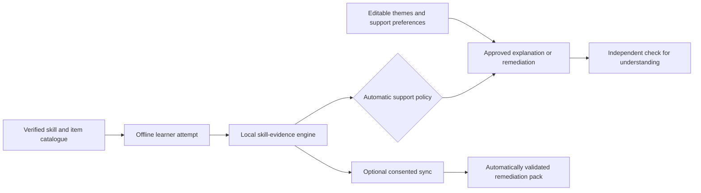

# Education Cloud — Engineering PRD
> Version 1.2 | August 2026
> Status: **DRAFT — Pending Stakeholder Approval**

> **Implementation-status correction (21 July 2026):** This document contains
> a future product vision, not a statement of shipped capability. The only
> implemented MVP is the English Grade 3 Maths Android retrieval-first demo,
> original unreviewed Grade 1–12 USSD demo content, and sandbox-only inbound
> USSD callback. There is no enabled on-device LLM, cloud tutor, SMS dispatch,
> voice/IVR, parent reporting, school hub, production database, or production
> Africa's Talking integration. `MVP_LAUNCH_CHECKLIST.md` is the authoritative
> readiness record; every Track A/B/C item below requires its stated release
> gates before it may be presented as available.

> **Long-term learner adaptation:** Proposed requirements for consented learner
> discovery, accessibility support, skill-specific adaptation, guardian feedback,
> and enrichment are in [docs/LONG_TERM_LEARNER_DISCOVERY_AND_ADAPTATION_PRD.md](docs/LONG_TERM_LEARNER_DISCOVERY_AND_ADAPTATION_PRD.md). It explicitly prohibits IQ/EQ scoring, disability diagnosis, ranking, and automated high-stakes decisions.

> **Adaptive-learning update (8 August 2026):** EduCloud will be a primarily
> self-directed, downloadable learner app. Generated remedial practice must not
> wait for a teacher to approve or unlock it. Instead, it is delivered only when
> it passes bounded automatic checks for schema, supported skill scope,
> provenance label, and arithmetic. This does not make EduCloud a diagnostic,
> aptitude-testing, or unrestricted AI-teaching product.

> **Positioning update (22 August 2026):** The next product phase is defined by
> [docs/HOME_STUDY_COMPANION_V2_PRODUCT_PLAN.md](docs/HOME_STUDY_COMPANION_V2_PRODUCT_PLAN.md)
> — a home-first, fun, AI-personalized study companion evolving from the MVP.
> That plan supersedes this document's Track A/B/C positioning: on-device LLMs are
> permanently disabled (all candidates failed `MODEL_EVALUATION.md`), intelligence
> moves cloud-side (Claude primary + open-weight fallback behind an abstraction),
> teacher/school surfaces become a future channel only, and feature order is
> interest re-explanation → knowledge tracing → competency decision support. The
> engineering guardrails here (provenance labelling, claim discipline, consent-gated
> sync, ethical prohibitions) remain fully binding.

---

## 1. Product Overview

### 1.1 Problem Statement

~250 million students in Sub-Saharan Africa lack access to qualified teachers and reliable internet. In Kenya specifically:
- **1 teacher per 60+ students** in rural areas
- **Only 48.8% of rural households** have an internet user (versus 81.9% urban) — (CA/KNBS ICT Report 2023–24)
- **Mobile phones are the primary access device** for most Kenyans, but many learners rely on feature phones or low-RAM (\u22642 GB) Android devices
- The Competency-Based Curriculum (CBC/CBE, 2-6-3-3-3 structure) launched in 2017 but has insufficient teaching resources

### 1.2 Solution

**Education Cloud is proposed** as a multi-modal AI tutoring system that could
operate across three tracks after validation and release gates:

| Track | Device | Connection | AI Location | User |
|-------|--------|-----------|-------------|------|
| **A** | Android (2GB+ RAM) | Offline | On-device (Qwen2-0.5B) | Student |
| **B** | Any phone (button/feature/smartphone) | GSM network | Cloud (Gemini Flash) | Student, Parent |
| **C** | Raspberry Pi Hub | Local WiFi | Hub-side (Qwen2-0.5B) | School |

### 1.3 Non-Goals (MVP)

- ❌ Gamification / leaderboard systems (Week 6+)
- ❌ Blockchain certificates (use W3C Verifiable Credentials)
- ❌ Federated learning (Month 4+)
- ❌ Multi-country curriculum (Kenya CBC only for MVP)
- ❌ Video content or rich media lessons
- ❌ Real-time chat/messaging between students

### 1.4 Target Users

| Persona | Device | Literacy | Primary Channel |
|---------|--------|----------|-----------------|
| **Student (Urban)** | Android 2-4GB | Literate (Swahili/English) | Track A (app) |
| **Student (Rural, phone)** | Nokia/Tecno button phone | Semi-literate | Track B (Voice > USSD > SMS) |
| **Student (Rural, no phone)** | Shared family phone | Low literacy | Track B (Voice) or Track C (School Hub) |
| **Parent** | Any phone | Variable | Track B (SMS reports) |
| **Teacher** | Android smartphone or laptop | Literate | Track A (Teacher Copilot) or Track C (Hub dashboard) |

---

## 2. System Architecture

### 2.1 High-Level Architecture Diagram

```
┌─────────────────────────────────────────────────────────────────────────┐
│                        EDUCATION CLOUD SYSTEM                          │
│                                                                        │
│  ┌──────────────────┐   ┌──────────────────┐   ┌──────────────────┐   │
│  │   TRACK A         │   │   TRACK B         │   │   TRACK C         │  │
│  │   ON-DEVICE       │   │   CLOUD-BACKED    │   │   SCHOOL HUB     │  │
│  │                   │   │                   │   │                   │  │
│  │  Android App      │   │  Django Server    │   │  Raspberry Pi 5   │  │
│  │  ┌─────────────┐ │   │  ┌─────────────┐ │   │  ┌─────────────┐ │  │
│  │  │ Kotlin /    │ │   │  │ Webhook     │ │   │  │ Flask Server│ │  │
│  │  │ Compose +   │ │   │  │ Handlers    │ │   │  │ + llama.cpp │ │  │
│  │  │ LiteRT-LM   │ │   │  │             │ │   │  │             │ │  │
│  │  └─────┬───────┘ │   │  └──────┬──────┘ │   │  └──────┬──────┘ │  │
│  │        │         │   │         │         │   │         │         │  │
│  │  ┌─────▼───────┐ │   │  ┌──────▼──────┐ │   │  ┌──────▼──────┐ │  │
│  │  │ Qwen2-0.5B  │ │   │  │ Gemini Flash│ │   │  │ Qwen2-0.5B │ │  │
│  │  │ Q4_K_M      │ │   │  │ API         │ │   │  │ Q4_K_M     │ │  │
│  │  └─────┬───────┘ │   │  └──────┬──────┘ │   │  └──────┬──────┘ │  │
│  │        │         │   │         │         │   │         │         │  │
│  │  ┌─────▼───────┐ │   │  ┌──────▼──────┐ │   │  ┌──────▼──────┐ │  │
│  │  │ sqlite-vec  │ │   │  │ PostgreSQL  │ │   │  │ sqlite-vec │ │  │
│  │  │ RAG DB      │ │   │  │ + Redis     │ │   │  │ RAG DB     │ │  │
│  │  └─────────────┘ │   │  └─────────────┘ │   │  └────────────┘ │  │
│  │                   │   │                   │   │                   │  │
│  │  INPUT: Touch UI  │   │  INPUT:           │   │  INPUT: WiFi     │  │
│  │  OUTPUT: Screen   │   │  B1: USSD *384#   │   │  clients         │  │
│  │                   │   │  B2: SMS 40384     │   │  OUTPUT: Screen  │  │
│  │                   │   │  B3: Voice Call    │   │  + local TTS     │  │
│  │                   │   │  B4: SIM Toolkit   │   │                   │  │
│  │                   │   │  B5: IVR Lessons   │   │                   │  │
│  └──────────────────┘   └──────────────────┘   └──────────────────┘   │
│                                                                        │
│  ┌──────────────────────────────────────────────────────────────────┐  │
│  │  SHARED LAYER: Cloudflare CDN + Sync + Analytics + Parent Loop    │  │
│  └──────────────────────────────────────────────────────────────────┘  │
└─────────────────────────────────────────────────────────────────────────┘
```

### 2.2 Technology Stack

| Layer | Technology | License | Justification |
|-------|-----------|---------|---------------|
| **Mobile App** | Kotlin / Jetpack Compose + LiteRT-LM | Apache 2.0 | Native Android for minimal RAM overhead on 2GB devices; LiteRT-LM for on-device inference |
| **On-Device LLM** | Qwen2-0.5B Q4_K_M (GGUF) | Apache 2.0 | Commercial-friendly, multilingual, fits 2GB RAM |
| **Fallback LLM** | Phi-3 Mini 3.8B Q4 | MIT | For 4GB+ devices, stronger reasoning |
| **Cloud LLM** | Provider-abstracted (pin a current model at implementation time) | API | Cloud LLM with fallback to retrieval-only. Provider/model chosen per deployment. |
| **Embeddings** | multilingual-e5-small (~118MB) | MIT | Swahili-capable, 384-dim vectors |
| **Vector Store** | sqlite-vec (SQLite extension) | MIT | Zero dependencies, brute-force scan, ~30MB footprint |
| **Backend** | Django 5 + DRF | BSD | Mature, Africa's Talking SDK support |
| **Database** | PostgreSQL 16 | PostgreSQL | JSONB for flexible student records |
| **Cache/Sessions** | Redis 7 | BSD | USSD session state, AOF persistence for Pilot, Sentinel for HA later |
| **STT** | Whisper Large v3 (fine-tuned) | MIT | Swahili/African accent support |
| **TTS (Cloud)** | Kokoro | Apache 2.0 | Commercially safe, high quality |
| **TTS (Hub/Edge)** | Piper | MIT | CPU-friendly, runs on Raspberry Pi |
| **Telephony** | Africa's Talking API | SaaS | Pan-African USSD/SMS/Voice coverage |
| **Hub Hardware** | Raspberry Pi 5 (4GB) | — | $95, runs llama.cpp, local WiFi AP |
| **P2P Sync** | Google Nearby Connections API | Google | Replaces abandoned WiFi P2P libraries |

### 2.3 Data Model

```sql
-- Core Student Schema (PostgreSQL for Cloud)
-- Note: Track A (App) uses SQLite with INTEGER PRIMARY KEY instead of UUID to save storage footprint. Sync API maps these.

CREATE TABLE students (
    id              UUID PRIMARY KEY DEFAULT gen_random_uuid(),
    device_id       TEXT NOT NULL,
    alias           TEXT NOT NULL,
    grade           INTEGER NOT NULL CHECK (grade BETWEEN 1 AND 12),
    language_pref   TEXT DEFAULT 'sw',       -- ISO 639-1: 'sw', 'en'
    created_at      TIMESTAMPTZ DEFAULT NOW(),
    last_active     TIMESTAMPTZ,
    consent_given   BOOLEAN DEFAULT FALSE,
    consent_date    TIMESTAMPTZ,
    track           TEXT CHECK (track IN ('A', 'B', 'C'))
);
CREATE INDEX idx_students_device_id ON students(device_id);

CREATE TABLE interactions (
    id              UUID PRIMARY KEY DEFAULT gen_random_uuid(),
    student_id      UUID REFERENCES students(id),
    question        TEXT NOT NULL,
    ai_response     TEXT NOT NULL,
    rag_sources     JSONB,
    is_correct      BOOLEAN,
    time_taken_ms   INTEGER,
    subject         TEXT NOT NULL,
    strand          TEXT,
    difficulty      REAL DEFAULT 0.5,
    channel         TEXT CHECK (channel IN ('app','ussd','sms','voice','stk','ivr','hub')),
    created_at      TIMESTAMPTZ DEFAULT NOW()
);
CREATE INDEX idx_interactions_student_subject ON interactions(student_id, subject, created_at);
CREATE INDEX idx_interactions_channel_date ON interactions(channel, created_at);

CREATE TABLE irt_parameters (
    id              UUID PRIMARY KEY DEFAULT gen_random_uuid(),
    student_id      UUID REFERENCES students(id),
    subject         TEXT NOT NULL,
    strand          TEXT NOT NULL,
    ability_theta   REAL DEFAULT 0.0,
    items_seen      INTEGER DEFAULT 0,
    last_calibrated TIMESTAMPTZ,
    UNIQUE(student_id, subject, strand)
);

-- IRT is research-only until a field trial calibrates a pretested item bank.
-- It must not drive the downloadable app from a handful of learner answers.

CREATE TABLE learner_preferences (
    student_id          UUID REFERENCES students(id) PRIMARY KEY,
    selected_themes     JSONB NOT NULL DEFAULT '[]', -- controlled values only
    requested_supports  JSONB NOT NULL DEFAULT '[]', -- e.g. large_text, one_step_at_a_time
    last_confirmed_at   TIMESTAMPTZ NOT NULL DEFAULT NOW()
);

CREATE TABLE skill_evidence (
    id                   UUID PRIMARY KEY DEFAULT gen_random_uuid(),
    student_id           UUID REFERENCES students(id),
    skill_id             TEXT NOT NULL,
    item_id              TEXT NOT NULL,
    presentation_variant TEXT NOT NULL, -- neutral, football, large_text, etc.
    support_used         TEXT,
    is_correct           BOOLEAN NOT NULL,
    error_code           TEXT,
    provenance_version   TEXT NOT NULL,
    attempted_at         TIMESTAMPTZ NOT NULL DEFAULT NOW()
);
CREATE INDEX idx_skill_evidence_student_skill ON skill_evidence(student_id, skill_id, attempted_at);

CREATE TABLE learning_state (
    student_id          UUID REFERENCES students(id),
    skill_id            TEXT NOT NULL,
    evidence_band       TEXT NOT NULL, -- not_enough_evidence, practising, review_due, stretch_ready
    confidence_range    TEXT NOT NULL, -- broad, explainable range; never a diagnostic score
    next_action         TEXT NOT NULL,
    scheduled_review_at TIMESTAMPTZ,
    updated_at          TIMESTAMPTZ NOT NULL DEFAULT NOW(),
    PRIMARY KEY(student_id, skill_id)
);

CREATE TABLE remediation_packs (
    id                  UUID PRIMARY KEY DEFAULT gen_random_uuid(),
    student_id          UUID REFERENCES students(id),
    skill_id            TEXT NOT NULL,
    content_version     TEXT NOT NULL,
    validation_status   TEXT NOT NULL CHECK (validation_status = 'automatic_validation_passed'),
    provenance_label    TEXT NOT NULL,
    payload             JSONB NOT NULL,
    created_at          TIMESTAMPTZ NOT NULL DEFAULT NOW()
);

-- Track A keeps equivalent records locally first. Cloud storage/sync is an
-- explicitly consented future capability, not a prerequisite to adaptation.

CREATE TABLE streaks (
    student_id      UUID REFERENCES students(id) PRIMARY KEY,
    current_streak  INTEGER DEFAULT 0,
    longest_streak  INTEGER DEFAULT 0,
    last_activity   DATE,
    freeze_available BOOLEAN DEFAULT TRUE
);
CREATE INDEX idx_streaks_last_activity ON streaks(last_activity);

CREATE TABLE parent_links (
    id              UUID PRIMARY KEY DEFAULT gen_random_uuid(),
    student_id      UUID REFERENCES students(id),
    parent_phone    TEXT NOT NULL,
    channel         TEXT CHECK (channel IN ('sms', 'whatsapp')),
    consent_verified BOOLEAN DEFAULT FALSE,
    created_at      TIMESTAMPTZ DEFAULT NOW()
);
CREATE INDEX idx_parent_links_phone ON parent_links(parent_phone);
```

### 2.4 API Contracts & Versioning

All endpoints use `/api/v1/`. Backward compatibility is maintained for 12 months post v2 launch.

#### Track B1: USSD Webhook (Africa's Talking Callback)

```python
# POST /api/v1/ussd/callback
# Request (from Africa's Talking):
{
    "sessionId": "ATSId_abc123",
    "serviceCode": "*384#",
    "phoneNumber": "+254712345678",
    "text": "1*2*3",
    "networkCode": "63902"      # Safaricom
}
# Response (plain text, max 182 chars):
"CON Habari! Chagua somo:\n1. Hesabu\n2. Sayansi\n3. Kiswahili\n4. English"
```

#### Sync API (Track A → Cloud)

**Authentication**: Device fingerprint generated at first launch, stored in Android Keystore, swapped for `device_token` via server, rotated every 90 days. Rate Limit: 10 syncs/device/day.

```python
# POST /api/v1/sync
# Authorization: Bearer {device_token}
{
    "device_id": "abc123",
    "student_id": "uuid",
    "app_version": "1.2.0",
    "content_version": "cbc-content-v2.1",
    "last_sync": "2026-06-28T10:00:00Z",
    "scores": [
        {"subject": "math", "strand": "algebra", "score": 0.72, "items": 15}
    ],
    "analytics": {
        "sessions_count": 12, "questions_asked": 45,
        "avg_inference_ms": 3200, "oom_events": 0
    }
}
# Success Response:
{
    "status": "ok",
    "new_content_available": true,
    "content_url": "https://cdn.educloud.ke/content/cbc-content-v2.2.zip",
    "content_size_bytes": 2048000
}
# Error Response Example (Rate Limited):
{
    "error": {
        "code": "RATE_LIMITED",
        "message": "Max 10 syncs per day exceeded",
        "retry_after": 3600
    }
}
```

### 2.5 Adaptive Learner Loop (Post-MVP)

EduCloud's adaptive capability is a **Skill Evidence Map**, not a simulated
brain and not a score of a learner's intelligence or potential. It tracks only
demonstrated evidence for a curriculum skill and chooses the next support from
the versioned, verified content contract.



The loop must be intelligible to the learner and guardian: it can say, for
example, “You missed two regrouping questions, so let us practise trading one
ten for ten ones.” It must not say that the app has detected an inherent
ability, learning disorder, personality type, or permanent weakness.

---

## 3. Functional Requirements

### FR-01: On-Device AI Tutoring (Track A) — P0

| Attribute | Specification |
|-----------|---------------|
| **Input** | Text via touch keyboard |
| **Processing** | Embed (multilingual-e5-small) → sqlite-vec top-3 → Qwen2-0.5B generates answer |
| **Output** | Text with source citation ("Grade 5 Science, Chapter 3") |
| **Latency** | P95 < 8s on Tecno Pop 7 (2GB) |
| **Offline** | 100% offline after initial setup |
| **Distribution** | Play Store via AAB + Play Asset Delivery for base app; SD cards for Pilot |
| **Memory** | < 500MB total app RAM footprint |
| **Fallback** | If free RAM < 600MB: return RAG passages directly, no LLM generation |

### FR-02: USSD Channel (Track B1) — P0

| Attribute | Specification |
|-----------|---------------|
| **Service Code** | *384# (registered via Africa's Talking) |
| **Session Timeout** | 180 seconds |
| **Screen Limit** | 182 chars |
| **Features** | Subject → topic → age verification → quiz (A/B/C/D) → result + explanation |
| **State** | Redis, 180s TTL per sessionId. Disaster recovery: AOF for pilot |

### FR-03: SMS Channel (Track B2) — P0

| Attribute | Specification |
|-----------|---------------|
| **Shortcode** | 40384 |
| **Keywords** | `JIBU [question]`, `SOMO [subject]`, `MSAADA`, `STOP`, `JOIN` |
| **Response** | < 30s, max 3 SMS (480 chars) |
| **Streak SMS** | Daily 7:00 AM EAT cron |

### FR-04: Voice Call (Track B3) — P1

| Attribute | Specification |
|-----------|---------------|
| **Pipeline** | Call → DTMF menu → record → Whisper STT → Gemini Flash → Kokoro TTS → play |
| **Latency** | P95 < 8s total, P50 < 5s |
| **Duration** | Max 10 min (cost cap) |
| **Anti-abuse** | DTMF CAPTCHA, 10 calls/day/number |

### FR-05: IVR Pre-Recorded Lessons (Track B5) — P1

| Attribute | Specification |
|-----------|---------------|
| **Description** | Dial in → navigate lesson menu with keypad → listen to pre-recorded audio |
| **No AI Required** | Pure audio playback — cheapest voice channel |
| **Content** | 2-minute lessons per topic, Swahili + English |
| **Quiz** | End-of-lesson DTMF quiz: "Press 1 for A, Press 2 for B..." |

### FR-06: Adaptive Learning — P2 (Post-MVP)

**Purpose:** help a learner get the right explanation, review, or stretch task
from their demonstrated progress in a specific skill. The product term is
**Skill Evidence Map**. “Phantom brain” is an internal research metaphor only
and must never appear in learner-facing copy or marketing.

| Stage | Capability | Product status |
|---|---|---|
| **A. Explainable local adaptation** | Fixed evidence bands, error codes, deterministic spaced review, and approved next actions | First implementation target |
| **B. Bayesian knowledge tracing experiment** | Per-skill mastery estimates evaluated against the deterministic baseline on consented pilot data | Research/pilot only |
| **C. Deep knowledge tracing experiment** | Sequence model trained and evaluated on a sufficiently large, representative historical dataset | Future research only |

The first product must not claim calibrated 2PL IRT, BKT, DKT, predicted
failure probabilities, or learning efficacy. The existing hackathon demo uses
fixed bands and a deterministic 1/3/7/14/30-day review schedule; its three
questions are not enough data to estimate ability or model a learner.

#### FR-06.1: Skill evidence capture

- Every scored item must have an immutable `item_id`, one or more `skill_id`
  values, a provenance version, a verified answer, and an explicit scoring rule.
- The app records only task-relevant evidence: correctness, selected answer,
  error code, support used, presentation variant, and time of attempt.
- A theme, font size, audio option, or reading support is never treated as an
  ability signal. It is stored as a presentation choice so its effect can be
  evaluated fairly.
- The local data model is the source of truth. Cloud sync remains optional and
  requires separate, revocable consent.

#### FR-06.2: Deterministic intervention policy

- The first version uses content-defined, product-controlled rules, not trained learner
  prediction. For example, repeated regrouping errors on independent approved
  items may trigger a concrete tens-and-ones explanation before another hard
  regrouping question.
- Each `next_action` must be reproducible from the recorded skill evidence and
  explainable in plain language.
- The engine schedules review, supplies prerequisite practice, or offers a
  stretch task. It must not hide a learner from grade-level content forever,
  lower an answer key, or make school-placement decisions.
- Exact thresholds are testable product hypotheses, not psychometric claims,
  until validated with a suitable pilot population.

#### FR-06.3: Automatic remediation delivery

- A learner does **not** wait for teacher approval to receive a remediation
  lesson. The backend may compile one original micro-lesson from bounded,
  anonymous error patterns and deliver it directly after automatic validation.
- Automatic validation requires: schema version match; supported Grade 3 Maths
  skill; exactly three bounded teaching steps; valid two-digit arithmetic;
  fixed provenance label; and a known content version.
- The automatic status is `automatic_validation_passed`. It is an integrity
  result, not proof that an LLM is pedagogically correct in all situations.
- Generated remediation must remain limited to original, non-scored practice.
  It cannot alter verified curriculum facts, answer keys, or scored assessments.

#### FR-06.4: Knowledge-tracing model lifecycle

- **Baseline first:** compare every future learner model against the fixed-band
  policy using held-out learners and future attempts, not the same events used
  to fit it.
- **BKT before DKT:** a simple, per-skill Bayesian model is preferred for the
  first research experiment because its assumptions and outputs are easier to
  inspect. Its parameters must be fitted only after a consented field trial and
  a pretested item bank.
- **DKT later, if justified:** an LSTM/transformer sequence model requires a
  large, representative interaction dataset and must beat the BKT and
  deterministic baselines on calibration, usefulness of interventions, and
  fairness—not just AUC.
- No external knowledge-tracing dataset is assumed to transfer to Kenyan Grade
  3 learners, local language contexts, or EduCloud's item map without evidence.

#### FR-06.5: Personalised explanations — P2

Learners may choose up to three controlled, editable themes such as football,
animals, music, nature, transport, space, art, stories, or **no theme**. The
app may use the selected theme to reframe a verified *unscored* example, e.g.
explaining equal groups through football scores. Free-text interests are out of
scope until moderation and data-governance controls exist.

- Preserve the verified learning objective, source boundary, mathematical
  relationship, and answer across every themed version.
- Keep scored checks neutral or use validated equivalent variants; a learner
  must never need football knowledge, stronger English, or a faster device to
  demonstrate a maths skill.
- The first formats are plain-language text, visual steps, and practice. Mind
  maps, narration, audio lessons, and other multimodal formats are future
  presentation options only after device, copyright, quality, and accessibility
  evaluation.
- A generative service may rewrite retrieved, approved evidence into a bounded
  explanation or a non-scored example. It must not author scored tests, infer
  learner traits, or become the source of curriculum facts.

#### FR-06.6: Acceptance criteria

- A learner can view which recent items and supports produced a next-action
  recommendation; the UI shows “not enough evidence” rather than fake precision.
- A remediation pack with a missing field, unsupported skill, invalid status,
  malformed provenance label, or incorrect arithmetic is rejected before it is
  stored or retrieved by the app.
- Theme selection changes examples and presentation only; it never changes a
  verified answer or the scoring of an assessment item.
- With no network, the learner still receives deterministic lessons, evidence
  bands, and scheduled review from local data.
- Before pilot release, recommendations must be compared with independent,
  skill-aligned learner outcomes and reviewed for material differences across
  language, access-support, device, and other lawful/equitable groups.

### FR-07: Parent Reports — P1

| Attribute | Specification |
|-----------|---------------|
| **Primary** | SMS via Africa's Talking (KES 0.80/msg) |
| **Secondary** | WhatsApp (Phase 3 deferral due to Business API costs) |
| **Frequency** | Weekly, Friday 6:00 PM EAT |
| **Consent** | Parent sends `JOIN [student_code]` |

### FR-08: Teacher Copilot — P2

- Lesson Plan Generator (Grade + Subject + Strand → 40-min plan)
- Auto-Grader (MVP: multiple-choice only; handwriting OCR deferred Month 3+)
- Class Dashboard (web UI from Hub or cloud)

### FR-09: School Hub (Track C) — P2

| Attribute | Specification |
|-----------|---------------|
| **Hardware** | Pi 5 4GB ($95) + solar ($25) + 128GB SD ($15) + Battery/Case ($35) = **$170** |
| **Software** | Flask + llama.cpp + sqlite-vec + Piper TTS + Kolibri + Kiwix |
| **Concurrency** | Max 3 LLM sessions (queue beyond) |
| **WiFi** | hostapd AP mode, no internet uplink |

### FR-10: SIM Toolkit (Track B4) — P3

- Menu app embedded on SIM card via MNO OTA update
- Requires Safaricom partnership. Deferred to Phase 3.

### FR-11: Daily Streak System — P1

- 7:00 AM SMS trigger or local notification
- SM-2 intervals, 1 freeze per 7 days
- Milestones at 7, 14, 30, 90, 365 days

### FR-12: Certificate System — P2

- W3C Verifiable Credentials, Ed25519 signed
- PDF + QR, verify via `GET /api/v1/certificates/verify/{id}` (UUID v4, rate-limited, returns minimal JSON)
- Trigger: ≥80% on strand mastery (20+ questions)

### FR-13: P2P Content Sharing — P3

- Google Nearby Connections API (BLE + WiFi Direct)
- Content sync only (NOT student data)
- Ed25519 signed content packages

### FR-14: Missed-Call Callback — P2

- Student "flashes" Education Cloud number → system calls back
- Education Cloud pays for outbound call
- Max 2 callbacks/day per number
- Enables zero-airtime access to Voice AI

### FR-15: Health & Readiness — P0

- `GET /api/v1/health` → 200 OK (basic liveness)
- `GET /api/v1/ready` → 200 OK if DB + Redis + AT connected, 503 otherwise

### FR-16: Observability — P0

- Structured JSON logging across all components
- Request correlation IDs injected across USSD/SMS/Voice sessions
- Prometheus metrics endpoint for request counts, latencies, error rates

### FR-17: Internationalization (i18n) — P1

- All user-facing strings externalized in JSON resource files keyed by ISO 639-1 (en, sw).
- Template engine for SMS and USSD formatting.

---

## 4. Complete Cost Breakdown

### 4.1 Development Costs (One-Time)

| Item | Cost |
|------|------|
| ODPC Registration (Kenya DPA) | $200 |
| USSD Shortcode Registration (Safaricom/Airtel) | $3,000 |
| Whisper fine-tuning (AfriSpeech) | $50 |
| CBC Grade 1-6 content digitization | $3,000 |
| Test devices (6 Kenya-market phones) | $500 |
| Hub prototypes (2× Pi 5 + solar setup) | $340 |
| Domain + shortcodes (annual) | $500 |
| **Total One-Time** | **$7,590** |

### 4.2 Monthly Costs by Scale

#### Pilot (500 students, 10 schools)

| Category | Monthly |
|----------|---------|
| Cloud (AWS af-south-1 EC2) | $120 |
| Managed PostgreSQL | $15 |
| Redis (AOF) | $10 |
| Gemini Flash 3.1 Lite (25K queries, 55M tokens) | $36 |
| SMS (5,000/mo @ KES 0.80) | $30 |
| USSD Setup/Rental | $350 |
| USSD Sessions (2,500 @ KES 1.0) | $20 |
| Voice (500 min, custom quote) | $25 |
| **Total** | **$606/mo** |
| **Per student/month** | **$1.21** |

#### Regional (5,000 students, 100 schools)

| Category | Monthly |
|----------|---------|
| AWS af-south-1 (2× EC2 + ALB) | $280 |
| PostgreSQL (dedicated) | $60 |
| Redis Cluster (Sentinel) | $50 |
| Gemini Flash 3.1 Lite (250K queries) | $360 |
| Whisper GPU (shared) | $100 |
| SMS (50,000/mo) | $280 |
| USSD Rental | $350 |
| USSD Sessions (25,000 @ KES 0.8) | $150 |
| Voice (5,000 min) | $250 |
| TTS (Kokoro self-hosted) | $80 |
| Cloudflare CDN + Backups | $20 |
| **Total** | **$1,980/mo** |
| **Per student/month** | **$0.39** |

#### National (50,000 students, 500 schools)

| Category | Monthly |
|----------|---------|
| Kubernetes (AWS EKS, 3 nodes) | $600 |
| PostgreSQL HA | $200 |
| Redis Cluster (3 nodes) | $120 |
| Gemini Flash 3.1 Lite (2.5M queries) | $3,600 |
| Whisper dedicated GPU | $400 |
| SMS (500,000/mo, bulk) | $2,500 |
| USSD Rental (Dedicated) | $1,200 |
| USSD Sessions (250,000 @ KES 0.6) | $1,100 |
| Voice (50,000 min, bulk) | $2,000 |
| TTS (dedicated GPU) | $200 |
| Cloudflare CDN + Monitoring | $150 |
| **Total** | **$12,070/mo** |
| **Per student/month** | **$0.24** |

### 4.3 Channel Cost Comparison

| Channel | Cost/Interaction | Literacy Needed | AI Level | Best For |
|---------|-----------------|-----------------|----------|----------|
| **Track A (App)** | $0.00 | Literate | Full LLM | Smartphone students |
| **USSD** | ~$0.012 | Semi-literate | Cloud AI | Quick quizzes |
| **SMS** | ~$0.006 | Semi-literate | Cloud AI | Async lessons, streaks |
| **Voice (AI)** | ~$0.05/min | **None** | Full AI | Non-literate (highest impact) |
| **IVR (recorded)** | ~$0.03/min | **None** | None | Cheapest voice, scalable |
| **Callback** | ~$0.05/min (we pay) | **None** | Full AI | Zero-airtime students |
| **School Hub** | $0.00 | Literate | Hub LLM | Classrooms |
| **SIM Toolkit** | ~$0.005 | Semi-literate | Cloud AI | Persistent menus |

> [!WARNING]
> **Voice is 5-50× more expensive than text channels.** Mitigations:
> 1. Cap free voice to 5 min/student/week
> 2. Use DTMF menus (reduce AI time)
> 3. Promote IVR pre-recorded lessons (no AI cost)
> 4. Negotiate bulk telephony rates
> 5. Seek toll-free sponsorship from Safaricom

### 4.4 Hardware Costs (School Hub Program)

| Component | Unit Cost (Kenya) | ×100 Schools | ×1,000 Schools |
|-----------|------------------|-------------|----------------|
| Raspberry Pi 5 4GB | $95 | $9,500 | $95,000 |
| Solar Panel (20W) | $25 | $2,500 | $25,000 |
| Battery (10Ah) | $20 | $2,000 | $20,000 |
| SD Card (128GB, pre-loaded) | $15 | $1,500 | $15,000 |
| Case + Shipping + Assembly | $15 | $1,500 | $15,000 |
| **Total per Hub** | **$170** | **$17,000** | **$170,000** |

### 4.5 Year 1 Total Budget

| Category | Amount |
|----------|--------|
| Development (one-time, setup) | $7,590 |
| Team salaries (12 months, 4 engineers) | $144,000 |
| Cloud infrastructure (AWS af-south-1) | $15,000 |
| Telephony (SMS + USSD + Voice) | $35,000 |
| AI API (Gemini Flash) | $10,000 |
| Hardware (100 School Hubs) | $17,000 |
| Travel & field operations | $6,000 |
| Contingency (15%) | $35,000 |
| **Grand Total (Year 1)** | **~$269,590** |

---

## 5. Build Timeline (12 Weeks)

### Phase 1: Core MVP (Weeks 1-4)

| Week | Deliverable |
|------|------------|
| **1** | App scaffold (PocketPal-AI fork), Qwen2 loading, basic chat UI |
| **1** | ODPC Registration filing, KICD licensing check |
| **1** | RAG pipeline: CBC content → embedded → sqlite-vec |
| **1** | CBC Grade 3-4 Math + Science content (Swahili + English) |
| **2** | Local Skill Evidence Map, deterministic review schedule, and automatic remediation-contract tests; no calibrated IRT claim |
| **2** | OOM fallback: device profiling, lazy loading, retrieval-only mode |
| **2** | Django backend, PostgreSQL schema, AT SDK integration |
| **3** | USSD webhook (B1): menu tree, quiz flow, Redis sessions |
| **3** | SMS webhook (B2): keyword parser, streak cron |
| **3** | CBC Grade 5-6 content (all 4 core subjects) |
| **4** | Parent Loop: weekly SMS reports, consent flow |
| **4** | Integration testing: AT sandbox + device testing |

### Phase 2: Voice + Engagement (Weeks 5-8)

| Week | Deliverable |
|------|------------|
| **5** | Voice pipeline (B3): AT webhook → Whisper → Gemini → Kokoro |
| **5** | IVR lesson library (B5): 30 pre-recorded lessons |
| **6** | Certificate system: W3C VC + PDF + QR verification |
| **6** | Teacher dashboard web UI |
| **7** | Accessibility Testing (TalkBack, Contrast), Cloudflare CDN |
| **7** | Pilot prep: SD cards, teacher training materials |
| **7** | Load testing: 1K USSD + 100 voice concurrent |
| **8** | **PILOT LAUNCH: 10 schools, 500 students, 2 counties** |

### Phase 3: Hardware + Scale (Months 3-4)

| Month | Deliverable |
|-------|------------|
| **3** | School Hub (Track C): Pi image, Flask, Piper, WiFi AP |
| **3** | P2P content sharing, missed-call callback, WhatsApp parent reports |
| **3** | Safaricom zero-rating business development |
| **4** | Teacher auto-grader (multiple-choice), federated learning PoC |

---

## 6. Risk Registry

| # | Risk | Prob | Impact | Mitigation |
|---|------|------|--------|-----------|
| R1 | OOM on 2GB devices | High | Critical | Device profiling, lazy load, retrieval-only fallback |
| R2 | LLM hallucinations | Medium | Critical | RAG mandatory, output filtering, 500+ test CI pipeline |
| R3 | Voice costs explode | High | High | Per-student caps, DTMF menus, IVR fallback, bulk rates |
| R4 | Gemini API outage | Low | High | Fallback to Claude Haiku; degrade to RAG-only |
| R5 | DPA non-compliance | Medium | Critical | DPIA before launch, ODPC registration, DPO |
| R6 | KICD licensing unclear | Medium | High | Written permission, use OER first |
| R7 | Teacher resistance | Medium | High | Copilot positioning, teacher training, dashboard |
| R8 | Zero-rating rejected | High | Medium | Build without dependency, treat as accelerator |
| R9 | Whisper accuracy | Medium | Medium | Fine-tune AfriSpeech + WAXAL, DTMF fallback |
| R10 | Voice line abuse | Medium | Low | DTMF CAPTCHA, rate limits, caller ID |
| R11 | Adaptive model overstates certainty or misroutes a learner | Medium | Critical | Start with explainable bands; validate against held-out outcomes; show “not enough evidence” |
| R12 | Interest-themed content changes what an assessment measures | Medium | High | Use themes only for non-scored examples until equivalent item variants are validated |
| R13 | Automatically generated remediation exceeds its bounded source or maths scope | Medium | Critical | Restrict skills, schema, source label, content version, teaching-step count, and arithmetic before learner delivery |

---

## 7. Pilot Success Criteria

| Metric | Target |
|--------|--------|
| D30 retention | > 30% |
| Pre/post test improvement | > 15% |
| Teacher NPS | > 40 |
| App crash rate | < 2% |
| OOM rate (2GB) | < 5% |
| RAG accuracy (teacher-rated) | > 85% |
| Parent engagement | > 30% |
| Voice latency (P95) | < 8s |
| Adaptation explanation | Learner/guardian can identify the evidence and next action in usability testing |
| Recommendation calibration | Confidence range matches later independent skill checks; no unsupported probability claim |
| Automatic remediation integrity | 100% of malformed, unsupported, or arithmetically invalid packs rejected in contract tests |

**Scale Gate Checklist:**
- [ ] All pilot metrics met
- [ ] ODPC Registration & DPIA completed and approved
- [ ] KICD content licensing confirmed in writing
- [ ] Load test passed (1K USSD + 100 voice concurrent)
- [ ] OWASP Mobile Top 10 security audit completed
- [ ] Teacher training playbook tested

---

## 8. Appendices

### A. Glossary

| Term | Definition |
|------|-----------|
| **CBC** | Competency-Based Curriculum / Competency-Based Education (Kenya, 2-6-3-3-3 model) |
| **KICD** | Kenya Institute of Curriculum Development |
| **IRT** | Item Response Theory (adaptive difficulty) |
| **KT** | Knowledge tracing: estimating a learner's evolving state for named skills from learning events |
| **BKT** | Bayesian Knowledge Tracing: an interpretable, per-skill probabilistic KT approach |
| **DKT** | Deep Knowledge Tracing: a sequence-learning KT approach requiring substantial representative data |
| **Skill Evidence Map** | EduCloud's learner-facing, explainable record of demonstrated skill evidence and the next support |
| **RAG** | Retrieval-Augmented Generation |
| **GGUF** | Quantized model format for llama.cpp |
| **STK** | SIM Toolkit (app on SIM card) |
| **IVR** | Interactive Voice Response |
| **DTMF** | Dual-Tone Multi-Frequency (phone keypad signals) |
| **OOM** | Out-of-Memory (Android kills app) |
| **DPIA** | Data Protection Impact Assessment |
| **ODPC** | Office of the Data Protection Commissioner (Kenya) |
| **MNO** | Mobile Network Operator (Safaricom, Airtel) |

### B. Licensing Summary

| Component | License | Commercial ✅/❌ |
|-----------|---------|-----------------|
| Qwen2-0.5B | Apache 2.0 | ✅ |
| llama.cpp | MIT | ✅ |
| Jetpack Compose | Apache 2.0 | ✅ |
| LiteRT-LM | Apache 2.0 | ✅ |
| sqlite-vec | MIT | ✅ |
| multilingual-e5-small | MIT | ✅ |
| Piper TTS | MIT | ✅ |
| Kokoro TTS | Apache 2.0 | ✅ |
| Whisper | MIT | ✅ |
| Django | BSD | ✅ |

### C. Referenced Documents

- [RESEARCH_FOUNDATION.md](file:///c:/Users/user/EDU CLOUDE/RESEARCH_FOUNDATION.md) — Technical research, model benchmarks
- [DIFFERENTIATION_BRAINSTORM.md](file:///c:/Users/user/EDU CLOUDE/DIFFERENTIATION_BRAINSTORM.md) — Strategic features, business model
- [prd_pressure_test.md](file:///C:/Users/user/.gemini/antigravity-ide/brain/f90358c8-51a7-45c6-bb4e-c74c0a21aacc/prd_pressure_test.md) — Pressure Test Audit (resolved)
- [Meta TRIBE v2](https://ai.meta.com/research/publications/a-foundation-model-of-vision-audition-and-language-for-in-silico-neuroscience/) — Neuroscience research inspiration only; not an EduCloud learner-model input
- [Deep Knowledge Tracing](https://stanford.edu/~cpiech/bio/papers/deepKnowledgeTracing.pdf) — Foundational sequence-model research
- [Knowledge Tracing survey](https://arxiv.org/html/2105.15106v4) — Taxonomy, applications, and model-selection cautions
- [BKT and deep learning for interventions](https://jedm.educationaldatamining.org/index.php/JEDM/article/view/318) — Student-model comparison for intervention research
- [Fairness of BKT for learners with different reading ability](https://educationaldatamining.org/EDM2025/proceedings/2025.EDM.long-papers.158/index.html) — Fairness consideration for future validation
- [Google Learn Your Way](https://research.google/blog/learn-your-way-reimagining-textbooks-with-generative-ai/) — Interest- and grade-aware source transformation reference

### D. Adaptive learner-model research register

The following register preserves every source supplied with the August 2026
research note. Inclusion means “consider during research or validation”; it
does **not** approve a technique for production or imply that results transfer
to EduCloud's intended learner population.

| Area | Source | Use in this PRD |
|---|---|---|
| In-silico neuroscience | [TRIBE v2 paper](https://ai.meta.com/research/publications/a-foundation-model-of-vision-audition-and-language-for-in-silico-neuroscience/), [model card](https://huggingface.co/facebook/tribev2), [code](https://github.com/facebookresearch/tribev2) | Inspiration for modelling changing state only; no fMRI, model weight, or architecture is used by EduCloud. |
| Foundational KT | [Deep Knowledge Tracing](https://stanford.edu/~cpiech/bio/papers/deepKnowledgeTracing.pdf), [KT survey PDF](https://arxiv.org/pdf/2105.15106), [KT survey HTML](https://arxiv.org/html/2105.15106v4), [2025 deep-KT review](https://dl.acm.org/doi/10.1145/3729605.3729620), [cognitive-processing survey](https://www.sciencedirect.com/science/article/abs/pii/S0925231225025512) | Model landscape and later experimental design. |
| KT for interventions | [Deep Learning vs. BKT: Student Models for Interventions](https://files.eric.ed.gov/fulltext/EJ1195512.pdf), [journal record](https://jedm.educationaldatamining.org/index.php/JEDM/article/view/318), [BKT fairness study](https://educationaldatamining.org/EDM2025/proceedings/2025.EDM.long-papers.158/index.html) | Baseline comparison, intervention evaluation, and fairness requirements. |
| Interpretability and enriched KT | [Cognitive assimilation + IRT](https://www.sciencedirect.com/science/article/abs/pii/S1568494625006428), [HELP-DKT](https://www.nature.com/articles/s41598-022-07956-0), [heterogeneous graph KT](https://www.frontiersin.org/journals/psychology/articles/10.3389/fpsyg.2024.1359199/full), [DKVMN&MRI](https://pmc.ncbi.nlm.nih.gov/articles/PMC11524465/), [KT with learning curves](https://pmc.ncbi.nlm.nih.gov/articles/PMC10097988/), [multiple learning features](https://www.mdpi.com/2071-1050/15/12/9427), [MSKT](https://www.nature.com/articles/s41598-025-07422-7) | Future research references only; they do not override the explainability-first baseline. |
| BKT background | [BKT overview](https://www.emergentmind.com/topics/bayesian-knowledge-tracing), [BKT primer](https://www.emergentmind.com/topics/bayesian-knowledge-tracing-bkt) | Orientation material; primary studies and field data govern implementation decisions. |
| Personalised explanations | [Google Research: Learn Your Way](https://research.google/blog/learn-your-way-reimagining-textbooks-with-generative-ai/), [Google education post](https://blog.google/outreach-initiatives/education/learn-your-way/), [technical explainer](https://kartaca.com/en/how-googles-learn-your-way-powered-by-learnlm-creates-the-adaptive-textbook-of-the-future/), [Forbes coverage](https://www.forbes.com/sites/danfitzpatrick/2025/11/16/google-reinvents-the-school-textbook-with-ai/), [additional explainer](https://techpilot.ai/tools/learn-your-way/) | Controlled-theme, source-preserving explanation design; only the official Google source supports product claims. |

---

*Skills: `architect-review`, `backend-architect`, `product-manager-toolkit`, `deep-research`, `cost-optimization`, `security-auditor`*
*Last Updated: August 8, 2026 | Education Cloud Engineering PRD v1.2*
