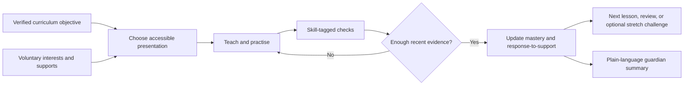

# Long-Term PRD: Learner Discovery, Adaptive Support, and Enrichment

> **Status:** Proposed long-term product capability — not MVP scope, not implemented, and not approved for learner deployment.  
> **Owner:** Edu Cloude product and safeguarding leads  
> **Last updated:** 31 July 2026

## 1. Decision summary

Edu Cloude should eventually offer a consented learner-discovery system after onboarding that adapts verified lessons to a learner's demonstrated mastery, stated interests, accessibility needs, and response to instruction.

It must **not** claim to diagnose dyslexia, ADHD, autism, a learning disability, IQ, EQ, giftedness, or a learner's fixed potential. A few app questions cannot do any of those things responsibly. Formal learning-disability diagnosis is a multi-source professional process; it may include history, academic and psychological testing, and medical assessment [NICHD](https://www.nichd.nih.gov/health/topics/learning/conditioninfo/diagnosed). A single score is especially inappropriate for making educational decisions about children.

The product language is therefore:

| Do not say | Say instead |
|---|---|
| “The AI detected dyslexia.” | “Recent practice suggests that reading sounds/words may be difficult. Here are supports that may help; consider discussing persistent difficulty with a teacher or qualified specialist.” |
| “This child has high/low aptitude.” | “This learner is currently ready for more challenge in these verified skills” or “This learner needs more support with these prerequisite skills.” |
| “IQ/EQ result.” | “Learning profile: current skill evidence, interests, preferred supports, persistence, and next learning steps.” |
| “Gifted/not gifted.” | “Challenge readiness in this topic, based on recent demonstrated mastery.” |

This is not cosmetic wording. It changes the evidence standard, data risk, parent expectations, and product architecture.

## 2. Product opportunity and hard truth

Interest-aware explanations can make content feel more relevant. A learner who loves football can meet fractions through match results, or probability through penalty kicks. Mainstream AI education products already market interest-based lesson hooks, so this alone is **not** a defensible differentiator [Khanmigo](https://www.khanmigo.ai/teachers). 

Edu Cloude's opportunity is stronger and narrower: **a curriculum-grounded learning loop that observes what support works for a learner, adapts the method without lowering expectations, and shows parents and teachers understandable evidence.**

The tempting but bad version is a personality quiz plus an LLM that produces labels. It will reward familiarity with the question context, literacy, device access, language, and test-taking confidence—not inherent ability. A football-themed maths item can unintentionally measure football knowledge or English reading ability as much as maths. Assessment fairness requires that irrelevant factors not interfere with demonstrating the skill being measured [National Academies](https://www.ncbi.nlm.nih.gov/books/NBK84220/).

## 3. Goals and non-goals

### Goals

1. Establish a private, editable learner profile that supports better teaching from the first week.
2. Determine **current mastery**, prerequisite gaps, and challenge readiness by curriculum skill.
3. Personalise examples and presentation without changing the verified learning objective or answer.
4. Offer accessible learning supports, particularly for observed reading difficulty, and measure whether they help.
5. Give guardians useful, non-stigmatising feedback and a clear route to teacher/professional input when persistent difficulty warrants it.
6. Preserve an offline-first route: core profiling and adaptation run locally; sync is optional and consented.

### Explicit non-goals

- Diagnosing any medical, developmental, psychological, or learning condition.
- Producing an IQ, EQ, personality, employability, or permanent "potential" score.
- School placement, eligibility, streaming, punishment, or any other high-stakes decision.
- Inferring disability, emotion, family circumstances, religion, ethnicity, or socioeconomic status from behaviour.
- Advertising, engagement optimisation, or sharing learner profiles with third parties.
- Treating low performance in English as evidence of low mathematical ability.

## 4. Product model: four distinct instruments, not one "aptitude test"

Conflating these instruments is the central product mistake to avoid.

| Instrument | Question answered | Evidence used | Parent-facing output | Permitted action |
|---|---|---|---|---|
| Learner preferences | “What makes learning feel relevant and comfortable?” | Voluntary choices; changeable at any time | Interests and requested supports | Theme, example, audio/text controls |
| Curriculum baseline | “Which prerequisite and grade-level skills are demonstrated now?” | Short, accessible, skill-tagged items | Skills secure / developing / not yet demonstrated | Start point and practice plan |
| Ongoing mastery and response-to-support | “Is this learner improving with this instruction?” | Repeated practice, attempts, confidence, accommodations used | Growth over time and next support | Change scaffolding, schedule practice, offer teacher review |
| Enrichment/challenge readiness | “Can the learner reliably apply this skill in a new context?” | Several mastered-skill checks plus transfer tasks | “Ready to try a stretch challenge” | Offer optional enrichment, never label ability |

The app may call the combined experience **Learning Discovery**. It must never present it as an aptitude, intelligence, or disability test.

## 5. Learner experience

### 5.1 Consent and control

Before any optional discovery activity, the guardian receives a short, readable notice:

> Edu Cloude uses answers and practice results to choose helpful lessons and examples. It does not diagnose a disability or measure IQ. You can skip optional questions, change answers, view what is stored, delete the profile, and choose whether any summary is shared with a teacher.

The child receives an age-appropriate version and is never told that a profile is permanent or that they are "bad at" a subject. Guardian consent must be separable for: (a) local adaptation, (b) microphone/oral reading, (c) cloud backup, and (d) teacher sharing.

### 5.2 Discovery flow (target: 6–10 minutes, skippable)

1. **Who is learning?** Local alias, age/grade, language of instruction, and optional guardian setup.
2. **Make it yours.** Choose up to three interest themes from controlled options: football, animals, music, nature, transport, space, superheroes, art, stories, community, or "no theme". Free text should be off initially; it creates moderation and privacy work.
3. **How should lessons help?** The learner can choose controls such as “read it aloud,” “show one step at a time,” “larger text,” “more pictures,” “extra time,” and “fewer words on a screen.” These are preferences, not diagnoses.
4. **Quick starting point.** A short adaptive curriculum baseline. Begin with easy, low-language-load tasks; branch only enough to find the next suitable skill. The learner can stop without penalty.
5. **Optional reading check.** Separate consent; it checks instructional skills such as letter–sound knowledge, word decoding, fluency, vocabulary, and comprehension. It never returns a condition label.
6. **First learning plan.** Present a positive, concrete next step: “Let’s practise adding tens with a football-score story,” not “You have medium aptitude.”

### 5.3 Ongoing learning loop



## 6. Reading support pathway

Reading support is the first recommended accessibility module because it is concrete and can be evaluated without pretending to diagnose. Evidence-based reading guidance recommends screening for difficulty, differentiating instruction, providing systematic foundational-skills teaching, and monitoring progress over time [IES](https://ies.ed.gov/ncee/wwc/PracticeGuide/3).

### 6.1 Observations permitted

The system may record only task-relevant observations, for example:

- letter–sound or phoneme-grapheme errors;
- difficulty decoding an unfamiliar word;
- accuracy and self-corrections on a controlled passage;
- comprehension after accessible presentation;
- whether audio, spacing, chunking, or repeated practice improved the result.

The system must not infer a diagnosis from any one observation, from camera data, from keystroke emotion analysis, or from a child's voice characteristics. Oral reading requires a separate opt-in and local processing by default.

### 6.2 Support ladder

| Need observed across practice | Immediate instructional response | Escalation threshold |
|---|---|---|
| Weak letter–sound mapping | Explicit phonics; say, tap, blend, and build activities | Persistent difficulty over a pre-specified number of sessions |
| Effortful, inaccurate reading | Short decodable text; repeated reading; pacing and highlighting | No meaningful progress despite planned support |
| Comprehension difficulty | Vocabulary preview; sentence chunking; picture/context support; gist questions | Separate decoding from comprehension before interpreting |
| Reading load masks subject skill | Audio-supported maths/science prompt, then a non-reading version of the check | Report subject mastery separately from reading performance |

The guardrail is essential: a reading-heavy maths question can measure reading more than maths. The product must offer an accessible equivalent before recording a maths gap.

### 6.3 Persistent-support notice

Only after repeated evidence under defined conditions, the guardian may see:

> “Over the last six reading activities, [alias] often needed support to sound out unfamiliar words. We have started structured phonics practice. This is not a diagnosis. If this pattern continues or concerns you, discuss it with the child's teacher or a qualified reading/health professional.”

No label is displayed to the child; no automatic referral, school classification, or external sharing occurs.

## 7. Enrichment and "aptitude" replacement

Parents want to know where a child may thrive. That is legitimate. The correct signal is **topic-specific challenge readiness**, not global aptitude.

### 7.1 Challenge readiness rule

A learner is offered a stretch task only when they have:

1. demonstrated the prerequisite skill on multiple occasions;
2. succeeded with reduced scaffolding;
3. applied it in at least one new but fair context; and
4. been offered an accessible version where a separate access need could distort the measurement.

Example: a Grade 3 learner who consistently solves addition problems can try multi-step football-score comparisons or explain two solution methods. Success means readiness for the next challenge **in that skill now**, not that the child has a high general aptitude.

### 7.2 Out-of-the-box questions

Use transfer tasks carefully. They should test the named curriculum skill, be teacher-authored/reviewed, and have an unambiguous scoring rubric. For each challenge item, store:

- skill and prerequisite IDs;
- language-demand level;
- theme variant;
- standard and accessible presentation variants;
- correct reasoning steps and accepted answer forms;
- source/provenance and reviewer;
- evidence that the item is fair for the intended age/language group.

LLMs may select from approved variants or fill bounded story variables. They must not freely create scored assessment items or determine a learner's band without the validated scoring engine.

## 8. Parent and teacher feedback

### Parent report: useful, calm, actionable

Monthly or on-demand reports should contain:

- **What is going well:** three demonstrated skills, not praise based on ranking.
- **What is being practised:** specific prerequisite or reading skill.
- **What helped:** e.g., audio plus one-step instructions improved completion.
- **Next two actions:** a short home activity and an in-app plan.
- **When to seek human input:** only for persistent, clearly explained patterns.
- **What this does not mean:** no diagnosis, fixed capability, or comparison with other children.

Do not show a single red/amber/green "child aptitude" score, a percentile, a leaderboard, or comparisons with named peers. Where class-level insight later exists, show teachers aggregated skill evidence and allow them to inspect the underlying attempts; never turn an AI recommendation into an automatic placement decision.

### Example parent wording

> **Maths:** Amina accurately compares two-digit numbers when the question is read aloud and is ready to practise word problems with fewer prompts.  
> **Reading support:** She benefits from listening to each sentence before reading it. We will keep building sound-out practice for unfamiliar words.  
> **Next:** Try the five-minute "match scores" activity twice this week. This report is a learning update, not an IQ or disability assessment.

## 9. Content and AI architecture

### 9.1 Separation of responsibilities

| Component | Authority | May do | Must not do |
|---|---|---|---|
| Curriculum/content service | Teacher-reviewed source pack | Define objective, prerequisites, assessment items, rubric, adaptations | Generate unreviewed curriculum claims |
| Deterministic measurement engine | Validated scoring rules | Score approved items, estimate mastery evidence, decide next skill | Diagnose or produce IQ/EQ |
| Personalisation service | Guardian/learner-controlled profile | Choose approved theme, format, and support | Infer sensitive characteristics |
| Generative explanation service | Bounded lesson context | Rephrase, create a non-scored example, encourage, ask one check question | Create scored tests, alter answer key, make labels |
| Guardian/teacher report service | Human-readable evidence templates | Summarise evidence and supports | Make a diagnosis, rank children, conceal uncertainty |

### 9.2 Required long-term data model

Store the minimum data needed to teach. In a future production schema, separate identifiers from learning evidence and encrypt both at rest.

```text
learner_profile
  learner_id, local_alias, grade, instruction_language, created_at, retention_choice

preference_profile
  learner_id, selected_themes[], requested_supports[], last_confirmed_at

consent_record
  learner_id, guardian_consent_version, local_adaptation, oral_reading,
  cloud_sync, teacher_sharing, granted_at, revoked_at

skill_evidence
  learner_id, skill_id, item_id, presentation_variant, support_used,
  response_score, attempt_date, provenance_version

learning_state
  learner_id, skill_id, evidence_band, confidence_range, next_action,
  explanation, updated_at

support_signal
  learner_id, skill_area, observed_pattern, evidence_window,
  recommended_support, human_review_status
```

Never create `iq_score`, `eq_score`, `disability_prediction`, `giftedness_label`, `behavioural_emotion_score`, or an opaque learner-ranking field.

### 9.3 Decision policy

- Make skill estimates probabilistic and explainable: display “not enough evidence” rather than fabricating precision.
- Require multiple recent observations before changing a mastery band or surfacing a persistent-support notice.
- Keep interest themes detachable from scoring. The same scored skill needs neutral and equivalent themed forms.
- Audit performance by language, region, gender where lawful and ethically justified, accessibility setting, device capability, and school context before expanding usage.
- Retain raw attempt data for the shortest approved period; create a deletion/export path from the start.

## 10. Measurement, validation, and launch gates

No score may be called a reliable indicator until it meets a validation plan agreed with educational measurement and safeguarding experts. Assessment fairness, reliability, validity, and appropriateness for the actual population are prerequisites, not post-launch polish [NCBI review](https://pmc.ncbi.nlm.nih.gov/articles/PMC11335701/).

### Required evidence before pilot

1. **Construct definition:** exact skill each item measures; proof it is not accidentally measuring English fluency, theme familiarity, device speed, or disability access.
2. **Content review:** Kenyan curriculum and classroom-teacher review; original or licensed content provenance recorded.
3. **Usability/accessibility study:** children, guardians, and teachers test the flow, language, time limit, audio controls, and opt-out path.
4. **Pilot psychometrics:** reliability, item difficulty, discrimination, missingness, and differential item functioning across intended learner groups.
5. **Outcome validity:** compare recommendations with independently teacher-assessed performance and progress, not merely internal engagement.
6. **Harm review:** false-positive/false-negative cases, language bias, stigma, parent misunderstanding, and digital-exclusion effects.
7. **Human-review protocol:** named qualified reviewers, escalation rules, response times, and an appeals/correction path.

### Product success metrics

| Metric | Success condition | Anti-metric / stop condition |
|---|---|---|
| Learning impact | Improvement on independently reviewed, skill-aligned checks | Higher engagement without learning improvement |
| Adaptation usefulness | Learners receiving a support show better later performance than their own comparable baseline | Support systematically lowers challenge or worsens outcomes for a group |
| Recommendation calibration | Confidence matches actual later performance | Bands overstate certainty or differ unjustifiably by group |
| Parent comprehension | Most test parents correctly state that it is not diagnosis/IQ | Parents describe labels as diagnosis, ranking, or destiny |
| Equity | Equivalent accuracy and access across tested groups | Material unexplained disparity or inaccessible route |

## 11. Privacy, safeguarding, and legal gate (Kenya first)

Learning profiles, inferred interests, and especially any purported disability/health signal are highly sensitive in practice. Kenya's Data Protection Act defines both profiling and sensitive personal data, including health and family information [Kenya Law](https://new.kenyalaw.org/akn/ke/act/2019/24/eng%402022-12-31). Kenya's data-protection regulations identify processing children's or sensitive data as a case requiring a data-protection impact assessment [ODPC regulations](https://www.odpc.go.ke/wp-content/uploads/2024/03/THE-DATA-PROTECTION-GENERAL-REGULATIONS-2021-1.pdf). This section is product guidance, not legal advice; obtain Kenyan counsel and ODPC-aligned review before pilot.

Non-negotiable controls:

- DPIA and child-rights impact assessment before data collection or pilot.
- Verifiable guardian consent; age-appropriate child assent; granular, revocable choices.
- Local-first processing; cloud sync disabled by default; no data sale, ads, or third-party model training.
- Separate consent for voice, teacher sharing, and any new purpose.
- Encryption, role-based access, audit logs, retention schedule, export/correction/deletion workflows.
- No covert emotion analysis, camera monitoring, location tracking, contacts access, or behavioural advertising.
- A human route for parent complaints, corrections, and professional referral questions.

UNICEF's current child-centred AI guidance emphasises privacy, non-discrimination, transparency, accountability, inclusion, and the child's best interests [UNICEF](https://www.unicef.org/innocenti/reports/policy-guidance-ai-children). Those principles should be formal release gates, not a marketing page.

## 12. Delivery roadmap

### Phase 0 — Foundation and governance (before build)

- Commission teacher, special-education, psychometric, safeguarding, accessibility, and Kenyan privacy review.
- Define the first narrow population: Grade 3, English instruction, one or two approved subjects.
- Create original/licensed, teacher-reviewed item banks and equivalent accessible forms.
- Complete DPIA, consent UX, data-retention policy, incident response, and review protocol.

### Phase 1 — Low-risk personalisation (first buildable product)

- Voluntary interest cards, large text, audio, pace, and one-step-at-a-time settings.
- Theme templates applied only to approved, non-scored examples.
- Local skill baseline for Grade 3 Maths; no voice, no disability signals, no parent reports.
- Evidence screen saying precisely which items informed each recommended next skill.

**Exit gate:** learners and teachers can explain why the next lesson was recommended; baseline does not worsen outcomes for any tested access group.

### Phase 2 — Adaptive mastery and guardian insights

- Skill graph, spaced review, challenge readiness, and plain-language local guardian report.
- Cloud sync only for explicitly consented profiles, with deletion/export and access logging.
- Small teacher-reviewed pilot, independent outcome comparison, and bias analysis.

**Exit gate:** recommendations correlate with independent teacher evidence; parent comprehension testing confirms no diagnosis/IQ misunderstanding.

### Phase 3 — Reading support signals

- Separate, consented reading-skills module; start with on-screen exercises, then consider local oral-reading analysis.
- Structured phonics/fluency support, response-to-support monitoring, and persistent-support notices.
- Human-review and referral guidance, never automated classification.

**Exit gate:** validated for the actual languages, age group, devices, and setting; professional reviewers agree the wording and escalation are safe.

### Phase 4 — Enrichment and multi-subject adaptation

- Teacher-reviewed transfer/challenge bank; broader approved curriculum and language support.
- School dashboard only after governance, permission, and evidence gates are met.
- Ongoing fairness monitoring and external audit.

## 13. What must not be built yet

Do not add any of the following to the current Grade 3 Maths prototype:

- a disability detector, IQ/EQ quiz, aptitude ranking, or giftedness label;
- microphone collection, cloud learner profiles, parent messaging, or teacher dashboards;
- generated/ungrounded aptitude questions;
- automated student grouping or school placement;
- free-text interest collection without moderation and data-governance design.

The current repo is a narrow, demo-only, retrieval-first Grade 3 Maths implementation. Its existing onboarding and optional remediation pathway are useful architectural starting points, but they are not evidence that the proposed system is ready. The honest next move is a written research and pilot programme, not adding another screen to the demo.

## 14. Open decisions for product leadership

1. Which first user has authority over the profile: guardian, teacher/school, or both?
2. Which exact languages, grades, and regions are in the first validation population?
3. Will Edu Cloude fund independent psychometric and safeguarding review before describing any feature as assessment?
4. What evidence is sufficient for a guardian notice, and who owns the human response path?
5. Is the product willing to refuse school customers that demand ranking, diagnosis, or automated placement?

## 15. Research basis

- [NICHD: How learning disabilities are diagnosed](https://www.nichd.nih.gov/health/topics/learning/conditioninfo/diagnosed)
- [IES: Assisting primary-grade students struggling with reading](https://ies.ed.gov/ncee/wwc/PracticeGuide/3)
- [IES: Foundational skills for K–3 reading](https://ies.ed.gov/ncee/wwc/PracticeGuide/21/Published)
- [National Academies: measurement and assessment fairness](https://www.ncbi.nlm.nih.gov/books/NBK84220/)
- [Psychological assessment in school contexts: ethical and practical guidance](https://pmc.ncbi.nlm.nih.gov/articles/PMC11335701/)
- [Kenya Data Protection Act](https://new.kenyalaw.org/akn/ke/act/2019/24/eng%402022-12-31)
- [ODPC Data Protection General Regulations, 2021](https://www.odpc.go.ke/wp-content/uploads/2024/03/THE-DATA-PROTECTION-GENERAL-REGULATIONS-2021-1.pdf)
- [UNICEF: Guidance on AI and children, version 3](https://www.unicef.org/innocenti/reports/policy-guidance-ai-children)
- [Khanmigo: current teacher product page](https://www.khanmigo.ai/teachers)

